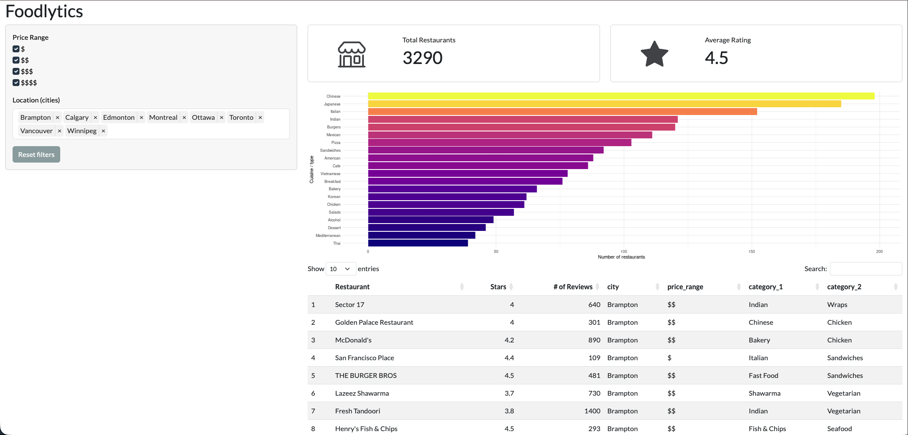

# Foodlytics

A small R version of the [Foodlytics dashboard in python](https://github.com/UBC-MDS/DSCI-532_2026_23_foodlytics). This dashboard visualizes restaurant quality and type across Canada’s main cities. It is aimed at businesses and entrepreneurs planning to open a new restaurant. The app helps users understand the local restaurant landscape so they can make better decisions about where to open and what type of restaurant to offer.



**Deployed app:** https://rabin-dsci-532-foodlytics-r.share.connect.posit.cloud/

## Run the application locally

R looks for `app.R` in the **current working directory**. Follow the instructions below to set the correct working directory.

1. Clone the repository and go into the folder project:

```bash
git clone https://github.com/rabin0208/DSCI-532-Foodlytics-r
cd DSCI-532-Foodlytics-r
```


2. R looks for `app.R` in the **current working directory**. Follow the instructions below to set the correct working directory.

Open `app.R` in RStudio, then go to **Session → Set Working Directory → To Source File Location**.

3. Install the required packages by running the following command the RStudio console:

```r
install.packages(c("shiny", "bslib", "ggplot2", "dplyr", "DT", "bsicons", "rsconnect"))
```

4. Start the application. Run the following in the terminal of RStudio:

```r
shiny::runApp("app.R")
```

## Deploy to Posit Connect Cloud

Posit Connect Cloud needs a `manifest.json` file in the repo (along the path to `app.R`) so it can install the right R packages and run the app.

**Generate `manifest.json` once (and again if you add packages or change the app):**

1. In R or RStudio, set the working directory to this project folder (e.g. **File → Open Project…** and open the repo, or `setwd("path/to/foodlytics")`).

2. Install the `rsconnect` package if you don’t have it: `install.packages("rsconnect")`.

3. Run:

```r
rsconnect::writeManifest(appDir = ".", appPrimaryDoc = "app.R")
```

4. Commit and push the new `manifest.json` to your GitHub repo. Then in Connect Cloud, connect the repo and deploy. It will find `manifest.json` next to `app.R`.